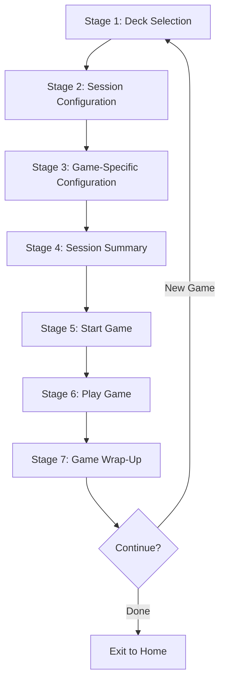

# Complete Game Flow: 7 Stages

## Overview
The complete game flow consists of 7 stages from initial setup to completion and stats display.

## Flow Diagram

---

## Stage 1: Deck Selection

**File**: [GameConfigurationView.swift](file:///Users/alanglass/_dev_local/Learn%20Comp%20Input/LearnCI/LearnCI/Views/Components/GameConfigurationView.swift)

Users select their game type and choose a deck to play with.

### Actions
1. **Pick Game Type**: Flashcards, Memory Match, Multiple Choice, etc.
2. **Choose Deck**: Either select a pre-made deck OR
3. **Filter by Tag**: Create a virtual deck by selecting a topic/tag

### Virtual Deck Creation
- Opens `TagSelectionSheet`
- Select language, level, and tag (e.g., "Food", "Travel")
- `DataManager.createVirtualDeck()` filters all cards with that tag
- Virtual deck is registered in memory

---

## Stage 2: Session Configuration

**File**: [SessionOptionsSheet.swift](file:///Users/alanglass/_dev_local/Learn%20Comp%20Input/LearnCI/LearnCI/Views/Components/SessionOptionsSheet.swift)

Configure general session settings that apply to all game types.

### Options
- **Time Limit**: 1-60 minutes
- **Card Goal**: Number of cards to review (5-100)
- **Navigation Style**: Swipe, Buttons, or Auto-Next
- **Confirmation Style**: Quiz, SRS, Show, or Auto
- **Audio**: TTS fallback, voice speed (0.2x-2.0x)
- **Card Order**: Sequential, Random, or Smart Queue

---

## Stage 3: Game-Specific Configuration

Each game type presents its own final configuration before gameplay.

> [!NOTE]
> If a game type does not have a Game-Specific Configuration screen yet, a placeholder should be used to maintain the 7-stage flow consistency.

### Flashcards: Layout Presets
**File**: [FlashcardConfigView.swift](file:///Users/alanglass/_dev_local/Learn%20Comp%20Input/LearnCI/LearnCI/Views/Games/FlashcardConfigView.swift)

| Preset | Description |
|--------|-------------|
| **Input Focus** | Text & Audio (Immersion) |
| **Audio Cards** | Audio Only (Listening) |
| **Picture Card** | Image & Text (Visual) |
| **Flashcard** | Text Only (Drill) |
| **Story** | Read & Listen (Immersion) |
| **Customize** | Custom display settings |

### Memory Match: Display Modes
**File**: [MemoryMatchConfigView.swift](file:///Users/alanglass/_dev_local/Learn%20Comp%20Input/LearnCI/LearnCI/Views/Games/MemoryMatchConfigView.swift)

| Mode | Front Side | Back Side |
|------|-----------|-----------|
| **Word to Word** | English word | Translation |
| **Word to Picture** | English word | Image |
| **Picture to Word** | Image | Translation |

---

## Stage 4: Session Summary

**File**: [SessionSummaryView](file:///Users/alanglass/_dev_local/Learn%20Comp%20Input/LearnCI/LearnCI/Views/GameView.swift#L792-L900) (embedded in GameView)

Before starting the game, users see a summary of all their selections:

- **Language & Level**: e.g., "🇪🇸 Spanish • A1"
- **Deck**: Selected deck name
- **Mode**: Game mode and preset (e.g., "Input Focus")
- **Session**: Duration and card goal
- **Options**: Navigation, confirmation, audio settings

Users can review and confirm before proceeding to gameplay.

---

## Stage 5: Start Game

**File**: [GameView.startActiveSession()](file:///Users/alanglass/_dev_local/Learn%20Comp%20Input/LearnCI/LearnCI/Views/GameView.swift#L440-L498)

When user taps "Start Game":
1. Load deck from `DataManager`
2. Apply session filters (card limit, order strategy)
3. Apply session configuration (navigation, confirmation, TTS)
4. Prepare session cards
5. Initialize SmartSessionManager if using Smart Queue
6. Transition to active game state

---

## Stage 6: Play Game

**File**: [ActiveSessionView](file:///Users/alanglass/_dev_local/Learn%20Comp%20Input/LearnCI/LearnCI/Views/Components/ActiveSessionView.swift)

The actual gameplay begins. The view routes to the appropriate game:
- **Flashcards**: [FlashcardGameView](file:///Users/alanglass/_dev_local/Learn%20Comp%20Input/LearnCI/LearnCI/Views/Games/FlashcardGameView.swift)
- **Memory Match**: [MemoryGameView](file:///Users/alanglass/_dev_local/Learn%20Comp%20Input/LearnCI/LearnCI/Views/Games/MemoryGameView.swift)
- **Multiple Choice**: [MultipleChoiceGameView](file:///Users/alanglass/_dev_local/Learn%20Comp%20Input/LearnCI/LearnCI/Views/Games/MultipleChoiceGameView.swift)
- **Audio Cloze**: [AudioClozeGameView](file:///Users/alanglass/_dev_local/Learn%20Comp%20Input/LearnCI/LearnCI/Views/Games/AudioClozeGameView.swift)
- **Story**: Reuses FlashcardGameView in linear mode

### During Gameplay
- Timer counts down from session duration
- Progress tracked (cards learned vs goal)
- Audio plays automatically based on configuration
- User interactions trigger grading/progression

---

## Stage 7: Game Wrap-Up (Stats)

**File**: [SessionFinishView](file:///Users/alanglass/_dev_local/Learn%20Comp%20Input/LearnCI/LearnCI/Views/GameView.swift#L200-L213)

When the session ends (timer expires or goal reached), users see completion stats:

### Stats Displayed
- **Cards Learned**: How many cards were marked as learned
- **Time Spent**: Actual time spent in session
- **Deck Info**: Which deck was played
- **Configuration**: Reminder of settings used

### Post-Session Actions
- **New Game**: Return to Stage 1 (Deck Selection)
- **Review Session**: View detailed breakdown
- **Exit to Home**: Return to main app

### Activity Logging
**File**: [GameView.saveActivity()](file:///Users/alanglass/_dev_local/Learn%20Comp%20Input/LearnCI/LearnCI/Views/GameView.swift#L545-L567)

Session data is automatically saved to user's activity history:
- Minutes spent
- Language studied
- Activity type (App Learning)
- Session details (deck name, cards learned, preset, order)

---

## Key Implementation Files

| Stage | Component | File |
|-------|-----------|------|
| **1** | Deck Selection | [GameConfigurationView.swift](file:///Users/alanglass/_dev_local/Learn%20Comp%20Input/LearnCI/LearnCI/Views/Components/GameConfigurationView.swift) |
| **1** | Tag Filtering | [TagSelectionSheet.swift](file:///Users/alanglass/_dev_local/Learn%20Comp%20Input/LearnCI/LearnCI/Views/Components/TagSelectionSheet.swift) |
| **2** | Session Options | [SessionOptionsSheet.swift](file:///Users/alanglass/_dev_local/Learn%20Comp%20Input/LearnCI/LearnCI/Views/Components/SessionOptionsSheet.swift) |
| **3** | Flashcard Config | [FlashcardConfigView.swift](file:///Users/alanglass/_dev_local/Learn%20Comp%20Input/LearnCI/LearnCI/Views/Games/FlashcardConfigView.swift) |
| **3** | Memory Match Config | [MemoryMatchConfigView.swift](file:///Users/alanglass/_dev_local/Learn%20Comp%20Input/LearnCI/LearnCI/Views/Games/MemoryMatchConfigView.swift) |
| **4** | Summary Display | SessionSummaryView in [GameView.swift](file:///Users/alanglass/_dev_local/Learn%20Comp%20Input/LearnCI/LearnCI/Views/GameView.swift#L792-L900) |
| **5** | Game Start Logic | [GameView.swift](file:///Users/alanglass/_dev_local/Learn%20Comp%20Input/LearnCI/LearnCI/Views/GameView.swift#L440-L498) |
| **6** | Game Router | [ActiveSessionView.swift](file:///Users/alanglass/_dev_local/Learn%20Comp%20Input/LearnCI/LearnCI/Views/Components/ActiveSessionView.swift) |
| **7** | Wrap-Up Screen | SessionFinishView in [GameView.swift](file:///Users/alanglass/_dev_local/Learn%20Comp%20Input/LearnCI/LearnCI/Views/GameView.swift#L200-L213) |
