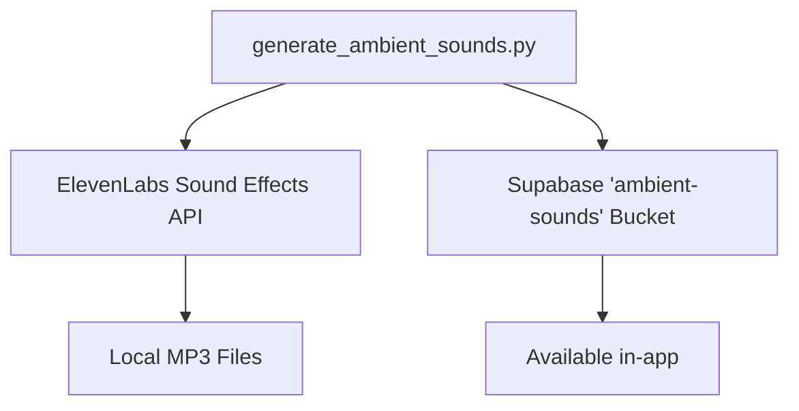

# Generate Ambient Sounds for Audio Stories

This plan outlines the generation of 18 high-quality ambient sound loops using ElevenLabs and uploading them to the Supabase `ambient-sounds` bucket.

## User Description
We will generate 18 specific ambient sound loops (2 per genre) that match the `AmbientSound.catalog`. These will be generated using AI and stored centrally in Supabase so they are available to all users.



## User Review Required
> [!IMPORTANT]
> **Audio Generation Methodology**: The sounds are generated using the **ElevenLabs Sound Generation API**. We use descriptive prompts (listed below) to create 22-second high-quality loops.
> 
> **AI Prompts Used**:
> - **Romance**: "Busy café background noise", "Crackling fireplace"
> - **Mystery**: "Heavy rain at night", "Creaking old building"
> - **Sci-Fi**: "Spaceship interior hum", "Futuristic city ambience"
> - (See full catalog in `generate_ambient_sounds.py`)

## Generation & API Logic

The generation process is handled by `generate_ambient_sounds.py`, which performs the following steps for each sound in the `SOUND_CATALOG`:

### 1. Prompt Construction
Prompts are defined as descriptive strings that emphasize atmosphere and texture (e.g., *"Heavy rain at night, falling on a roof, rhythmic water sounds, distant thunder"*). The script sends these directly to the model to guide the sonic characteristics.

### 2. API Call Structure
The script makes a `POST` request to `https://api.elevenlabs.io/v1/sound-generation` with the following JSON payload:

```json
{
  "text": "prompt_text",
  "loop": true,
  "duration_seconds": 22,
  "prompt_influence": 0.5,
  "model_id": "eleven_text_to_sound_v2"
}
```

- **`loop: true`**: This is critical; it instructs the ElevenLabs model to generate audio that transitions seamlessly from end to beginning.
- **`duration_seconds: 22`**: Provides enough temporal variety for a rich background without being excessively long.
- **`prompt_influence: 0.5`**: Ensures the AI follows the specific genre description while allowing for high-quality synthetic texture.

### 3. Upload Logic
Once the `.mp3` is received, it is uploaded to Supabase Storage using the **Service Role Key** to bypass RLS, ensuring the app's `AmbientSoundManager` can subsequently download and cache the file.

### [Scripts]
#### [NEW] [generate_ambient_sounds.py](file:///Users/alanglass/_dev_local/Learn%20Comp%20Input/LearnCI/scripts/generate_ambient_sounds.py)
- A new Python script that iterates through a hardcoded list of the 18 required sounds.
- **Usage**: `python3 generate_ambient_sounds.py` (requires environment variables for ElevenLabs and Supabase).
- **Logic**: Uses `ElevenLabs` Sound Generation API to generate 22-second high-quality loops.
- **Upload**: Authenticates with Supabase and uploads the files to the `ambient-sounds` bucket with the correct paths.

### [Models]
#### [MODIFY] [AmbientSound.swift](file:///Users/alanglass/_dev_local/Learn%20Comp%20Input/LearnCI/LearnCI/Models/AmbientSound.swift)
- Double-check that all 18 sound IDs and paths match exactly what the script will upload.

## Verification Plan

### Manual Verification
1.  **Generation**: Run the script and verify that 18 files are generated locally in a temp folder.
2.  **Upload**: Check the Supabase dashboard to verify the files exist in the `ambient-sounds` bucket under the `ambient/` folder.
3.  **Cross-Check**: Verify that the filenames match the `supabasePath` defined in `AmbientSound.swift`.
4.  **In-App Test**: Open a story in the app and verify the ambient sound downloads and plays correctly.
