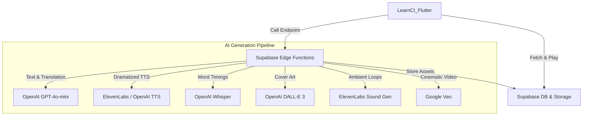

# Flutter Migration Plan: LearnCI Stories (Cross-Platform)

## Goal Description
Create a new Flutter application that replicates the story generation and playback features of the native `LearnCI` iOS app. This will enable high-quality language learning stories on both iOS and Android, leveraging the existing AI generation pipeline and Python script foundations.

## Project Introduction
- **Project Name**: `LearnCI_Flutter`
- **Target Directory**: `/Users/alanglass/_dev_local/Learn Comp Input/LearnCI_Flutter`
- **Supported Platforms**: **iOS**, **Android**, and **Web**.
- **Design Source**: **Google Stitch** ([Project: LearnCI-Flutter](https://stitch.withgoogle.com/projects/7821551760921390766))
- **Initial Setup**: 
    1. **I (Antigravity) will initialize the project** for you via `flutter create LearnCI_Flutter`.
    2. I will add the necessary dependencies: `supabase_flutter`, `just_audio`, `flutter_riverpod`, `google_fonts`.
    3. I will connect **Google Stitch** designs for UI component generation.
    4. You won't need to manually create the skeleton; I will handle the base architecture.

## User Description
The LearnCI Flutter app is a premium, AI-powered language immersion platform. It transforms static learning into a cinematic experience where the user is the creator.

### Key Features:
- **Comprehensive Story Control**: The app's heart is the **Story Maker**, giving users granular control over their learning journey.
- **Dramatized Multi-Track Audio**: High-fidelity AI voices coupled with 17 unique ambient sound loops.
- **Cinematic Visuals**: DALL-E 3 cover art and Veo-generated video previews for every story.
- **Interactive Reader**: Word-synced highlighting for native and target languages.
- **Cross-Platform Library**: Seamless access to your story vault across iOS, Android, and Web.

### The Story Maker: The Control Hub
The **Story Maker Screen** is the most critical part of the application. It provides the user with high-fidelity "levers" to shape the AI generation:
- **Topic Input**: Define the narrative core.
- **Complexity Levers**: Slide from Beginner to Master to match your comprehension level.
- **Tone & Humor**: Adjust the personality of the story from Serious to Playful.
- **Style Selection**: Choose between a single-narrator experience or a fully Dramatized production with multiple AI characters.
- **Ambient Settings**: Select the atmospheric backdrop (Sci-Fi, Marketplace, Rainforest, etc.).

- **Visual Consistency**: We'll use **Google Stitch** to iterate on the design language. I can then take the generated Stitch design tokens and components to build out the high-fidelity Flutter UI at lightning speed.
- **Dark Mode Primary**: Deep blacks and charcoal greys.
- **Vibrant Accents**: Use the genre-specific color palettes (e.g., Neon Teal for Sci-Fi, Warm Amber for Romance).
- **Glassmorphism**: Translucent panels with background blurs (via `BackdropFilter`).
- **Typography**: `Outfit` for headers, `Inter` for story text for maximum legibility.

### UI Mockups:

#### 1. Story Maker (The Control Hub)
The most important screen, where users adjust the levers of the AI generation.

#### 2. Home Screen (The Hub)
The dashboard for exploring stories and tracking progress.

#### 3. Generation Screen
A magical experience while the AI builds your story.

#### 4. Story Session (Player)
The core reading and listening experience.

## User Review Required
## Supabase Edge Functions: A Technical Primer

### What are they?
Supabase Edge Functions are server-side TypeScript functions that run on Deno's global network. They act as "serverless" endpoints that your Flutter app calls to perform complex logic (like prompting OpenAI) without needing a dedicated backend server.

### Why use them for Flutter?
Flutter apps (especially on Web or Android) cannot easily run Python scripts or complex Swift logic locally. Edge Functions allow we to port our existing Python generation logic into a unified backend that works for all platforms.

### How to Create & Deploy:
1. **Initialize CLI**: Run `supabase init`.
2. **Create**: `supabase functions new generate-story`.
3. **Logic**: Write your TypeScript/Deno code in `supabase/functions/[name]/index.ts`.
4. **Deploy**: `supabase functions deploy [name] --project-ref [your-project-id]`.

## Google Stitch Pre-requisites: Getting Started

Before we begin the implementation, there are a few steps **you (the user)** should take in Google Stitch:

1.  **Project Created**: I have already created the project for you: **[LearnCI-Flutter](https://stitch.withgoogle.com/projects/7821551760921390766)** (Project ID: `7821551760921390766`).
2.  **Initial Designs Generated**: I have already generated several variants for the **Home Screen** and **Story Maker** directly within the Stitch project.
3.  **Your Turn**: Visit the project link to review, iterate, and share the final versions you love. I will then "stitch" these into the Flutter codebase.

### Prompt Catalog for Google Stitch
*   **Home Screen**: `A premium mobile app Home Screen UI for a language learning app called LearnCI. The design features a dark, charcoal grey background with glassmorphism cards. Top card shows a daily streak with a glowing amber fire icon. Below, a 'Continue Learning' section shows a recent story card with a vibrant gradient border and a play button. Towards the bottom, there are quick action buttons for 'New Story', 'Vocabulary', and 'Progress'. The overall aesthetic is sleek, modern, and immersive, with subtle shadows and elegant typography. No device frame.`
*   **Story Maker**: `A premium mobile app 'Story Maker' screen for LearnCI. The interface allows users to adjust the 'levers' of their story generation. It features elegant, glowing sliders and toggle switches on a translucent glassmorphism surface. Options include 'Complexity Level' (Beginner to Master), 'Tone' (Serious to Playful), 'Style' (Dramatized vs Narrative), and a text input field for 'Story Topic'. A large, vibrant 'Generate Story' button sits at the bottom with a subtle pulsing glow. Dark mode aesthetic with neon teal highlights and sophisticated typography. No device frame.`
*   **Generation Screen**: `A premium mobile app UI for a 'Story Generation' screen. The screen is dark with a central, glowing holographic sphere that represents the AI at work. Around the sphere, delicate lines of code or language-learning symbols rotate slowly. Below the sphere, a stylized progress bar shows 'Writing the Narrative...', 'Generating Cinematic Voice...', and 'Creating Atmospheric Soundscapes...'. The overall vibe is magical, high-tech, and immersive, with deep purples and neon teal glows. No device frame.`
*   **Story Session**: `A premium mobile app UI mockup for a language learning story player on an iPhone. The screen features a beautiful blurred cover art background with a glassmorphism overlay. In the foreground, large, elegant typography shows a story in Spanish with the current word 'biblioteca' highlighted in a vibrant neon teal glow. Below the text are playback controls (play, pause, skip) and a subtle volume slider for ambient sound. The overall aesthetic is dark, sleek, and high-end, featuring smooth gradients and a modern, minimalist design. No device frame.`

## Google Stitch Integration: Design-to-Code Workflow

To achieve the premium look and feel planned for `LearnCI_Flutter`, we will use **Google Stitch** (stitch.withgoogle.com) as our AI-powered design engine. 

### 1. Collaborative Design
- **Prompt-to-UI**: We'll use Stitch to generate high-fidelity UI screens (The Hub, Library, Player) using the visual themes outlined (Dark Mode, Glassmorphism, Neon teal accents).
- **Prototyping**: Iterate on the layout and user flow within the Stitch interface to ensure the "magical" feel of the generation screen.

### 2. The Bridge (Design Tokens)
- **Token Export**: We'll extract design tokens (HSLA color values, spacing units, and typography styles) from the Stitch project.
- **Theme Data**: I will port these tokens directly into the Flutter `ThemeData` and a custom `DesignSystem` class within the app.

### 3. Rapid Component Development
- **Stitch-to-Flutter**: I will take the serialized design specs and component structures from Stitch and "stitch" them into functional Flutter Widgets.
- **Visual Accuracy**: This workflow ensures that the final app matches the AI-generated design with 100% fidelity, avoiding the "translation loss" between a static mockup and working code.

## Proposed Changes

### 1. Architecture & Backend Services
- **[NEW] Edge Functions (The AI Pipeline)**:
    - `generate-story`: Construct prompts and call GPT-4o-mini for target and native text.
    - `generate-audio`: Handle dramatized segment parsing and call ElevenLabs/OpenAI TTS.
    - `generate-timings`: Call Whisper API to extract word-level timestamps.
    - `generate-ambient`: Generates or retrieves a looping ambient background.
    - `generate-video`: Port the Veo generation logic to visualize story scenes.

### 2. Flutter UI/UX
- **Theme Engine**: Implement a premium theme with:
    - Custom fonts (Outfit/Inter).
    - Vivid gradients and glassmorphism (via `BackdropFilter`).
    - Smooth hero animations between story list and session view.
- **Core Views**:
    - `StoryMakerPage`: Input for topic/preferences.
    - `StorySessionPage`: Interactive player with scrolling text and ambient sounds.
    - `LibraryPage`: Grid view of generated stories with cover art.

### 3. Core Logic Porting
- **Audio Manager**: Replicate `AudioManager.swift` using `just_audio` (supports multiple players for concurrent ambient + narration).
- **Word Highlight Service**: A service to synchronize the `WordTiming` JSON with the current audio playback position.

## Verification Plan

### Automated Tests
- Unit tests for the `WordHighlightService` logic.
- Integration tests for Supabase Edge Function responses.

### Manual Verification
1. **Connectivity**: Verify Supabase login and data fetch on both iOS and Android emulators.
2. **Generation**: Trigger a story generation from the Flutter UI and verify it appears in the Supabase Dashboard.
3. **Playback**: Verify that ambient sounds loop correctly and text highlights sync with the narration.
4. **Resilience**: Ensure the app handles network interruptions during large audio downloads.
