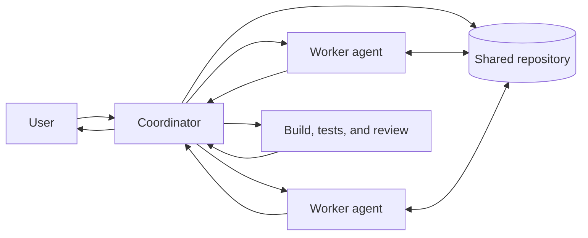

# Agent Dispatch Architecture

**Status:** Design reference  
**Audience:** Engineers and coding agents working on LearnCI  
**Scope:** Engineering automation for this repository; this is not part of the LearnCI iOS runtime

## Purpose

Agent dispatch turns a user request into one or more bounded units of engineering work, coordinates their execution, and returns one integrated, verifiable result. The coordinating agent remains accountable for the whole request even when it delegates part of the work.

## System Context



## Task Contract Format

| Field | Meaning |
|---|---|
| `task_id` | Stable identifier used in status and result messages |
| `objective` | One observable outcome, written as a command |
| `context` | Relevant user intent, architecture constraints, and known facts |
| `scope` | Files, modules, services, or questions the worker owns |
| `exclusions` | Work that must remain untouched |
| `deliverables` | Expected edits, findings, or recommendations |
| `verification` | Checks the worker should run or evidence it should collect |
| `completion_rule` | Conditions that mean the task is done |

## Verification & Handoff Rule

After completion of tasks on cloud branches, all handoffs must include the exact `git` sync command block:

```bash
git fetch origin
git checkout <branch-name>
git pull origin <branch-name>
```
