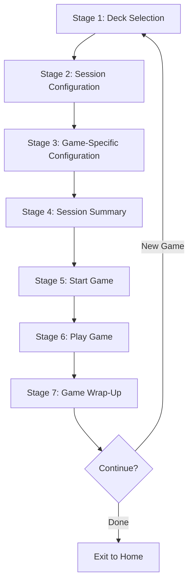

# Complete Game Flow: 7 Stages

## Overview
The complete game flow consists of 7 stages from initial setup to completion and stats display.

## Flow Diagram

---

## Stage 1: Deck Selection

Users select their game type and choose a deck to play with.

### Actions
1. **Pick Game Type**: Flashcards, Memory Match, Multiple Choice, etc.
2. **Choose Deck**: Either select a pre-made deck OR
3. **Filter by Tag**: Create a virtual deck by selecting a topic/tag (`TagSelectionSheet`)

---

## Stage 2: Session Configuration

Configure general session settings (`SessionOptionsSheet`) that apply to all game types: Time Limit, Card Goal, Navigation Style, Confirmation Style, Audio TTS, and Card Order.

---

## Stage 3: Game-Specific Configuration

Each game type presents its own final configuration before gameplay (e.g. `FlashcardConfigView` layout presets, `MemoryMatchConfigView` display modes).

---

## Stage 4: Session Summary

Summary screen (`SessionSummaryView`) showing Language & Level, Deck name, Game mode, and options prior to tap to play.

---

## Stage 5: Start Game

Initialization (`GameView.startActiveSession()`): loads card queues, applies filters and ordering strategies, and transitions to active game state.

---

## Stage 6: Play Game

Gameplay view (`ActiveSessionView`): routes to game-specific components (`FlashcardGameView`, `MemoryGameView`, `MultipleChoiceGameView`, `AudioClozeGameView`, `LinkerGameView`).

---

## Stage 7: Game Wrap-Up (Stats)

Completion statistics screen (`SessionFinishView`): displays cards learned, time spent, accuracy score, and logs user performance activity via `UserActivity`.
