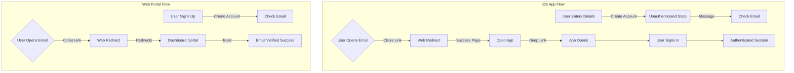

# LearnCI Authentication Flow - Plain English Guide

## Authentication Flow Diagram

## 📱 iOS App Flow

### 1. Sign Up (New User)
1.  **Open App:** You launch the app.
2.  **Create Account:** You enter your Name, Email, Password (twice to confirm), and phone number.
3.  **Check Email:** The app stops and tells you to "Check your email". You cannot sign in yet.
4.  **Verification:** You go to your email inbox and click the link from Supabase.
5.  **Redirect:** The link opens a webpage confirming you are verified, then automatically (or via button) opens the App.
6.  **Login:** Back in the app, you enter your email and password to sign in.

### 2. Login (Existing User)
1.  **Open App:** You launch the app.
2.  **Enter Credentials:** You enter your email and password.
3.  **Success:** You are logged in immediately.

### 3. Forgot Password
1.  **Request Reset:** You tap "Forgot Password" and enter your email.
2.  **Email Link:** You click the "Reset Password" link in your email.
3.  **New Password:** The app opens directly to a "New Password" screen. You set a new password and are logged in.

---

## 🌐 Web Portal Flow

### 1. Sign Up
1.  **Visit Site:** You go to the website and click "Sign Up".
2.  **Create Account:** You enter your Name, Email, and Password (twice to confirm).
3.  **Check Email:** The site tells you to check your email.
4.  **Verification:** You click the link in your email.
5.  **Success:** You are taken to the Portal Dashboard automatically.

### 2. Login
1.  **Visit Site:** You go to the website login page.
2.  **Enter Credentials:** You enter your email and password.
3.  **Success:** You are redirected to the Portal Dashboard.
