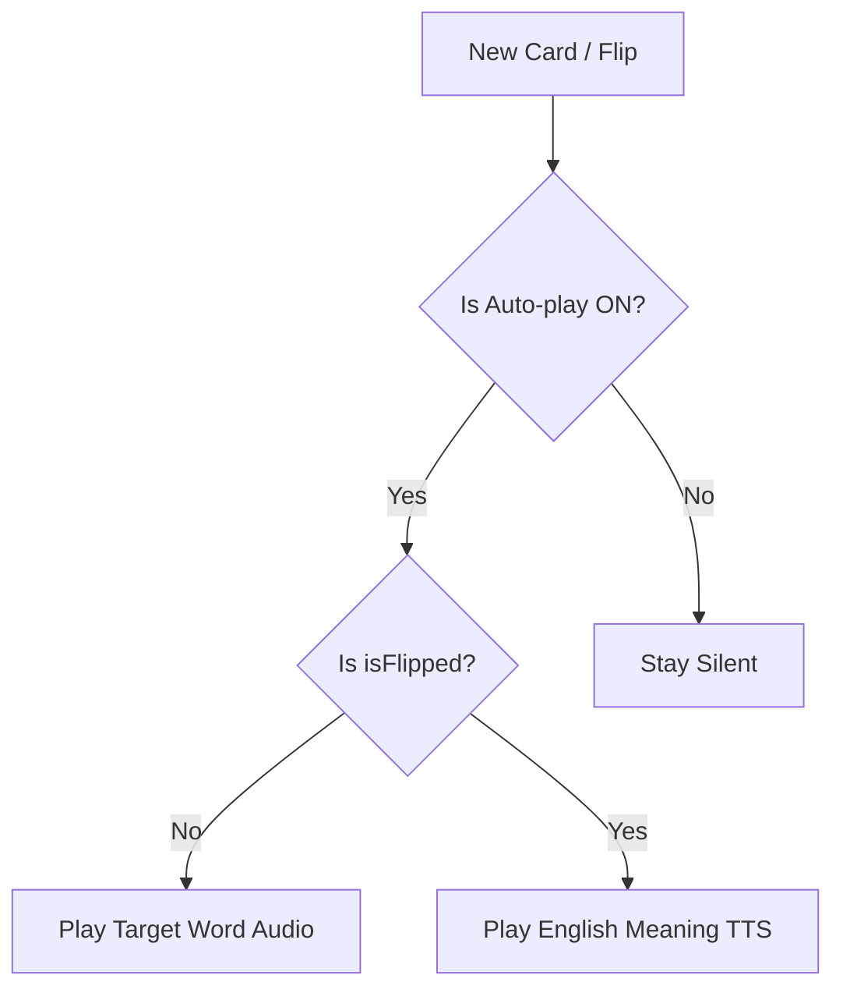

# implementation_plan_fix_audio_autoplay.md

This plan outlines the steps to resolve the issue where flashcards do not automatically play audio for the card word and translation.

## Goal Description
The objective is to ensure that audio feedback is provided automatically based on the user's game configuration. This requires adding support for English text-to-speech (for translations) and updating the view logic to trigger audio on card entry and flip events.

## User Description
When you move to a new card or flip one over, the app will automatically "speak" the text shown. 
- On the **Front**: Speaks the target language word.
- On the **Back**: Speaks the English translation.
- Settings: This only happens if "Auto-play" is enabled for that section in the Game Settings.

## User Review Required
> [!IMPORTANT]
> **English TTS Support**: We are adding English as a system-supported language for TTS fallback. This is necessary because translations are typically in English.

## Proposed Changes

### [Models]
#### [MODIFY] [LearningCard.swift](file:///Users/alanglass/_dev_local/Learn Comp Input/LearnCI/LearnCI/Models/LearningCard.swift)
- Add `english = "en"` to the `Language` enum.

### [Managers]
#### [MODIFY] [AudioManager.swift](file:///Users/alanglass/_dev_local/Learn Comp Input/LearnCI/LearnCI/Managers/AudioManager.swift)
- Update `speak(text:language:gender:rate:)` to handle `.english` with the `"en-US"` locale code.

### [Views]
#### [MODIFY] [GameView.swift](file:///Users/alanglass/_dev_local/Learn Comp Input/LearnCI/LearnCI/Views/GameView.swift)
- **Update `playCurrentCardAudio()`**:
    - Implement checks for `sessionConfig.word.autoplay` and `sessionConfig.sentence.autoplay`.
    - **Trigger first card audio**:
        - Update `.onChange(of: setupStage)` to call `playCurrentCardAudio()` when transitioning to `.playing`.
        - This ensures that if the deck was already loaded, audio starts immediately upon game entry.
    - Logic for `isFlipped == true`: Queue English TTS audio.
    - Logic for `isFlipped == false`: Queue target language audio (current behavior).
- **Modify `handleFlipState()`**:
    - Change logic to call `playCurrentCardAudio()` when flipping *to* the back instead of stopping audio.

## Verification Plan

### Manual Verification
1. **Target Language Playback**: Start a session (e.g., Spanish) with "Auto-play" enabled. Verify the target word plays on card appear.
2. **Translation Playback**: Flip the card. Verify the English translation is spoken.
3. **Toggle Settings**: Disable "Auto-play" for the word in settings. Verify the word no longer plays automatically on card appear.
4. **TTS Quality**: Verify the English speech sounds clear and correct.
