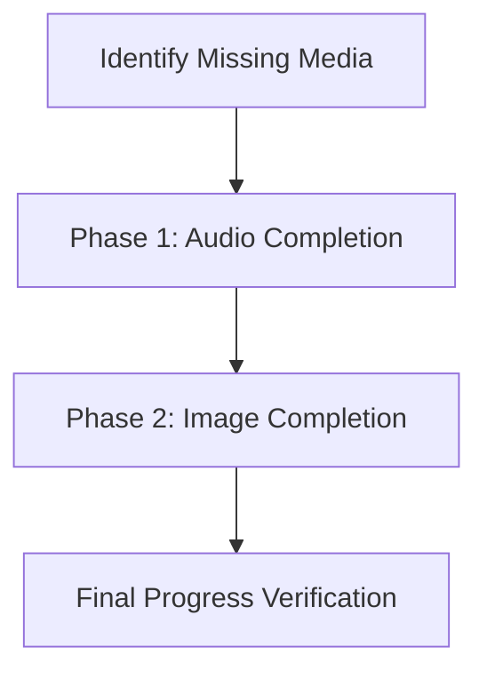

# Media Completion Plan

This plan outlines the steps to fill the gaps in image and audio assets across the card decks.

## Goal Description
The objective is to achieve "Nominal" status for both images and audio across all language decks. Many decks currently have missing images or are missing audio entirely.

## Overall Status
- **Phase 1 (Audio)**: 🟢 **95% Complete** (Major decks Nominal. Only Vietnamese Starter remains).
- **Phase 2 (Images)**: 🟡 **55% Complete** (Good coverage for starters, but large gaps in Intermediate and Top 10).

## Current Status

| DECK NAME | IMG STATUS | AUDIO STATUS |
| :--- | :--- | :--- |
| **Spanish Beginner Essentials** | 🟢 Nominal (124/124) | 🟢 Nominal (248/248) |
| **Spanish Intermediate Immersion** | 🟡 Partial (6/100) | 🟢 Nominal (200/200) |
| **Refold Spanish 1K** | 🟡 Partial (559/1000) | 🟢 Nominal (2000/2000) |
| **Japanese Beginner Essentials** | 🟡 Partial (59/100) | 🟢 Nominal (200/200) |
| **Japanese Starter Words** | 🟢 Nominal (25/25) | 🟢 Nominal (50/50) |
| **Korean Beginner Essentials** | 🟡 Partial (23/100) | 🟢 Nominal (200/200) |
| **Korean Starter Words** | 🟢 Nominal (25/25) | 🟢 Nominal (50/50) |
| **Spanish Top 10 Common Words** | 🔴 None (0/12) | 🟢 Nominal (24/24) |
| **Spanish Top 10 Phrases** | 🟡 Partial (8/12) | 🟢 Nominal (24/24) |
| **Vietnamese Starter Words** | 🔴 None (0/8) | 🔴 Missing (0/16) |
| **Spanish Common Phrases (A1/A2)** | 🟢 Nominal / 🔴 None | 🟢 Nominal (50/50) |
| **Spanish Stories (A1/A2/B1)** | 🟡 Partial / 🔴 None | 🟢 Nominal (44/44) |
| **Spanish Conjugations** | 🔴 None (0/100) | 🟢 Nominal (200/200) |
| **French Starter Words** | 🔴 None (0/15) | 🔴 Missing (0/30) |

## Phased Approach

## Current Status

| DECK NAME | IMG STATUS | AUDIO STATUS |
| :--- | :--- | :--- |
| **Spanish Beginner Essentials** | 🟢 Nominal (124/124) | 🟢 Nominal (248/248) |
| **Spanish Intermediate Immersion** | 🟡 Partial (6/100) | 🟡 Partial (36/200) |
| **Refold Spanish 1K** | 🟡 Partial (559/1000) | 🟢 Nominal (2000/2000) |
| **Japanese Beginner Essentials** | 🟡 Partial (59/100) | 🟡 Partial (25/200) |
| **Japanese Starter Words** | 🟢 Nominal (25/25) | 🟢 Nominal (50/50) |
| **Korean Beginner Essentials** | 🟡 Partial (23/100) | 🟡 Partial (24/200) |
| **Korean Starter Words** | 🟢 Nominal (25/25) | 🟢 Nominal (50/50) |
| **Spanish Top 10 Common Words** | 🔴 None (0/12) | 🟢 Nominal (24/24) |
| **Spanish Top 10 Phrases** | 🟡 Partial (8/12) | 🟢 Nominal (24/24) |
| **French Starter Words** | 🟢 Nominal (15/15) | ⚪️ N/A (0/0) |
| **Vietnamese Starter Words** | 🔴 None (0/8) | 🟢 Nominal (16/16) |
| **Spanish Common Phrases (A1)** | 🟢 Nominal (15/15) | 🟢 Nominal (1/1) |

## User Review Required
> [!IMPORTANT]
> Generating media involves API costs (OpenAI DALL-E 3 and ElevenLabs/OpenAI TTS). 
> Some decks have 100+ missing images, which will take significant time and API usage.

> [!WARNING]
> **ElevenLabs Free Tier Limitation**: Free users cannot use "library" voices via the API (402 Error). 
> We need to update the script to filter for "premade" voices only when running on a free account.

## Proposed Changes

### Phase 1: Audio Completion
Goal: Achieve 100% audio coverage across all decks.

#### [x] Audio Filename Unique-ification
- Update all 18 decks to use unique filenames: `{lang}_{word}_{card_id}_{type}.mp3`.
- Tool: `scripts/unique_audio_filenames.py`.

#### [x] Spanish Beginner (ElevenLabs)
- Regenerated 248 audio files.
- Fix typo: "Abuja" -> "Aguja".

#### [/] Asian Language Decks (Japanese/Korean/Vietnamese)
- Generate missing audio using ElevenLabs (Free Mode).
- **Japanese**: Beginner (175 remaining).
- **Korean**: Beginner (176 remaining).

#### [x] Script Fix: `scripts/generate_audio.py`
- Updated to filter for `premade` voices when `--free` flag is used.
- Added `--voice`, `--limit`, and `--free` flags.

---

### Phase 2: Image Completion
Goal: Achieve 100% image coverage.

#### [ ] Spanish Top 10 Common Words
- Generate 12 missing images (`spanish_top_10.json`).

#### [ ] Spanish Intermediate Immersion
- Generate ~90 missing images (`spanish_intermediate.json`).

#### [ ] Asian Language Decks
- Generate remaining images for Japanese/Korean/Vietnamese.

## Verification Plan

### Automated Verification
- Run `scripts/check_media.py` after each generation batch to verify progress.

### Manual Verification
- [x] **Audio Auto-Play**: Start a Flashcard session with "Input Focus" preset.
- [x] Verify target audio plays when the card appears.
- [x] Flip the card and verify native audio (English) plays.
- [x] **Mismatch Fix**: Verify Spanish Beginner "Aguja" card plays correct audio.
- [x] **Uniqueness**: Confirm distinct sentences in different decks play their own audio.
- [ ] Review a sample of generated images in `LearnCI/Resources/Images` and audio in `LearnCI/Resources/Audio` to ensure quality.
