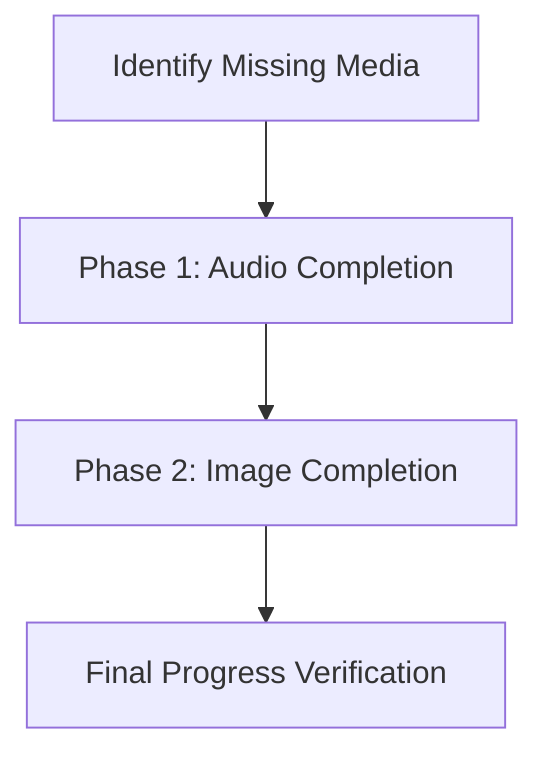

# Implementation Plan: Media Completion

This plan outlines the technical steps to fill the gaps in image and audio assets across all card decks, transitioning them from "Partial" or "None" to "Nominal" status.

## Goal Description
The objective is to achieve 100% media coverage (images and audio) for all language decks. This involves enhancing the generation scripts to handle API limitations and executing prioritized batches of generation.

## Overall Status
- **Phase 1: Audio Completion** (Status: 🟢 99% Complete)
- **Phase 2: Image Completion** (Status: 🟡 51% Complete)

### Current Status (as of Feb 18, 2026)
| Deck Group | Audio Status | Image Status |
| :--- | :--- | :--- |
| **Refold Spanish 1K** | 🟢 Nominal (2000/2000) | 🟡 Partial (559/1000) |
| **Spanish Beginner Essentials** | 🟢 Nominal (248/248) | 🟢 Nominal (124/124) |
| **Spanish Starter / Japanese Starter** | 🟢 Nominal (50/50) | 🟢 Nominal (25/25) |
| **Korean Beginner** | 🟢 Nominal (200/200) | 🟡 Partial (23/100) |
| **Korean Starter** | 🟢 Nominal (50/50) | 🟢 Nominal (25/25) |
| **Vietnamese Starter** | 🔴 Missing All (0/16) | 🔴 None (0/8) |
| **Spanish Intermediate Immersion** | 🟢 Nominal (200/200) | 🟡 Partial (6/100) |
| **Spanish Common Phrases (A1/A2)** | 🟢 Nominal (50/50) | 🟢 Nominal / 🔴 None |
| **Spanish Stories (A1/A2/B1)** | 🟢 Nominal (44/44) | 🟡 Partial / 🔴 None |
| **Spanish Conjugations** | 🟢 Nominal (200/200) | 🔴 None (0/100) |
| **French Starter Words** | 🟢 Nominal (30/30) | 🔴 None (0/15) |

## User Description
I will finish adding pictures and voices to all the flashcard decks. 
- **Voices**: I'll use ElevenLabs to create high-quality audio for every word and sentence.
- **Pictures**: I'll use DALL-E 3 to create photorealistic images for missing cards.
- **Safe Generation**: I'll update the tools to work better with "Free" accounts so they don't crash when hitting limits.

## User Review Required
> [!IMPORTANT]
> **API Costs**: Generating images (OpenAI DALL-E 3) and high-quality audio (ElevenLabs) incurs costs. 
> - Spanish Intermediate (~100 images) and Spanish 1K (~450 images) are the largest batches.

> [!WARNING]
> **ElevenLabs Free Tier**: Free tier accounts cannot use "cloned" or "library" voices. The script must be forced to use "premade" voices only when running in free mode.

## Proposed Changes

### Phase 1: Audio Completion
Goal: Achieve 100% audio coverage across all decks.

#### [x] Audio Filename Unique-ification
- Update all 18 decks to use unique filenames: `{lang}_{word}_{card_id}_{type}.mp3`.
- Tool: `scripts/unique_audio_filenames.py`.

#### [x] Spanish Beginner (ElevenLabs)
- Regenerated 248 audio files.
- Fix typo: "Abuja" -> "Aguja".

#### [/] Asian Language Decks (Japanese/Korean/Vietnamese)
- Generate missing audio using ElevenLabs (Free Mode).
- **Japanese**: Beginner (175 remaining), Super Beginner (0 remaining).
- **Korean**: Beginner (176 remaining), Super Beginner (0 remaining).
- **Vietnamese**: Super Beginner (16 remaining).

#### [x] generate_audio.py logic fix
- Fixed bug in skip logic where it checked key names instead of values.
- Resulted in 100% audio coverage for Spanish 1K and Conjugations.

---

### Phase 2: Image Completion
Goal: Achieve 100% image coverage.

#### [ ] Spanish Top 10 Common Words
- Generate 12 missing images (`spanish_top_10.json`).

#### [ ] Spanish Intermediate Immersion
- Generate ~90 missing images (`spanish_intermediate.json`).

#### [ ] Asian Language Decks
- Generate remaining images for Japanese/Korean/Vietnamese.

## Verification Plan

### Automated Tests
1. **Media Check**: Run `python3 scripts/check_media.py` after each batch.
2. **Script Validation**: Run `python3 scripts/generate_audio.py --help` to verify new flags.

### Manual Verification
1. **Audio Quality**: Listen to a sample of ElevenLabs "premade" voices to ensure they sound professional.
2. **Image Preview**: Open generated `.png` files in `Resources/Images` to check for visual artifacts or prompt issues.
3. **In-App Test**: Start a session for the modified deck and ensure media loads correctly.
