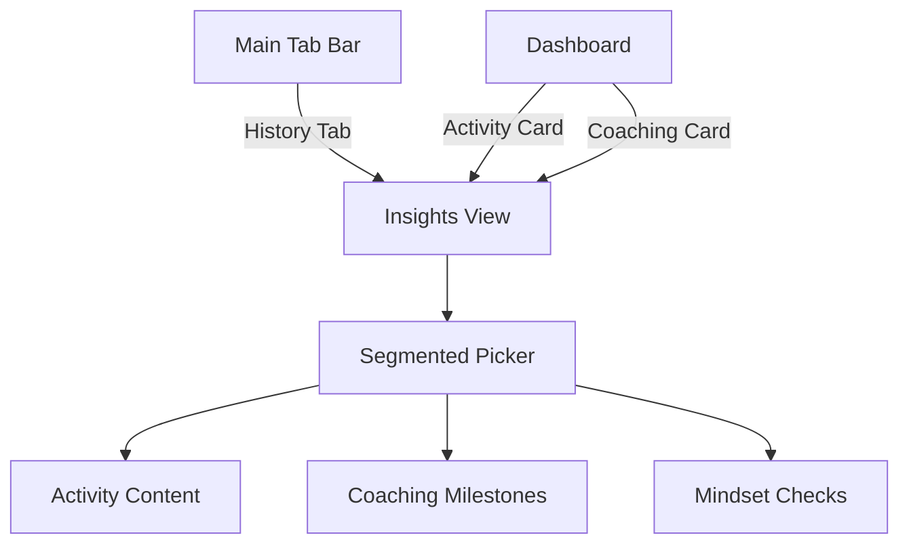

# Implementation Plan - iOS: Consolidate Activity, Coaching, and Mood Checks

This plan outlines the steps to merge the separate "Activity History", "Coaching Milestones", and "Language Mood Checks" into a single, cohesive navigation view in the iOS application.

## Goal Description
Currently, user history and feedback are split across two main tabs:
- **Activity** (`HistoryView.swift`): Shows immersion activity breakdown and history.
- **Coach** (`CoachingHistoryView.swift`): Shows daily mood checks and coaching milestones.

This change will consolidate these into one "Insights" or "History" view with a three-way picker for better organization and to free up space in the main tab bar.

## User Description
A new "Insights" view will be created. It will use a Segmented Picker at the top to allow users to switch between:
1. **Activity**: View daily immersion history and stats.
2. **Coaching**: Track progress towards milestones and coaching sessions.
3. **Mindset**: Review daily mood and learning sentiment.

The main tab bar will be simplified by removing the "Coach" tab, as its functionality is now integrated into the consolidated "Insights" view.

## Proposed Changes

### [Component Name] Navigation & Main Layout

#### [MODIFY] [MainTabView.swift](file:///Users/alanglass/_dev_local/Learn%20Comp%20Input/LearnCI/LearnCI/Views/MainTabView.swift)
- Remove `AppTab.coach`.
- Rename `AppTab.history` label to "Insights" or "History" (TBD based on design).
- Update the `TabView` to remove the `.coach` tag view.

#### [MODIFY] [DashboardView.swift](file:///Users/alanglass/_dev_local/Learn%20Comp%20Input/LearnCI/LearnCI/Views/DashboardView.swift)
- Update destinations for `coachingSection` and `breakdownSection` to point to the new consolidated view.
- Support deep-linking via a `@State` or environment variable if possible (e.g., `InsightsView(initialTab: .coaching)`).

### [Component Name] Insights View

#### [NEW] [InsightsView.swift](file:///Users/alanglass/_dev_local/Learn%20Comp%20Input/LearnCI/LearnCI/Views/InsightsView.swift)
- Create a new View that manages the consolidated state.
- Implement a `Picker` with `segmented` style for selecting between:
    - `.activities`
    - `.coaching`
    - `.mindset`
- Refactor logic from `HistoryView.swift` and `CoachingHistoryView.swift` into reusable child views or incorporate them directly.

#### [DELETE] [CoachingHistoryView.swift](file:///Users/alanglass/_dev_local/Learn%20Comp%20Input/LearnCI/LearnCI/Views/CoachingHistoryView.swift)
- Remove the old separate coaching history view once logic is migrated.

## Verification Plan

### Automated Tests
- Perform a full build in Xcode to ensure no broken references or syntax errors.
- Verify SwiftData queries still function correctly in the new view structure.

### Manual Verification
1. Launch the iOS app and navigate to the "Insights" tab.
2. Verify the segmented picker allows switching between Activity, Coaching, and Mindset.
3. Verify that data (Activity history, Milestones, Moods) matches previous versions.
4. Test "Add Activity" and "Add Mood" buttons within the consolidated view.
5. Verify that clicking "Coaching" or "Activity" cards on the Dashboard navigates to the correct tab in the Insights view.
