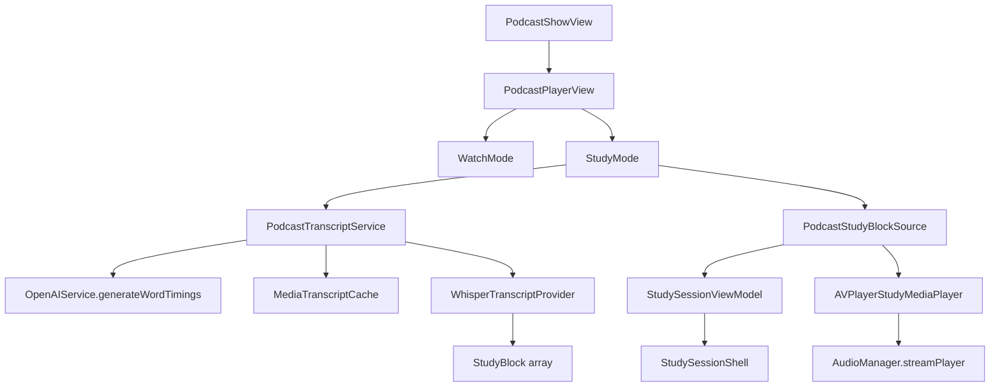

# Podcast Study Mode (iOS, Phase 4)

> Extends [controlled_study_mode_plan.md](controlled_study_mode_plan.md) — skips Phase 3 (stories) per product priority.

## Goal

Bring the controlled block-by-block study workspace to podcast episodes:

- Whisper word timings → grouped `StudyBlock`s
- Block-scoped playback via existing `StudySessionViewModel` / `StudyPlaybackController`
- Native-language translations (GPT batch, lazy-loaded)
- Notes, marked words, and session scoping (reuse `StudySessionShell`)
- Offline reuse via `MediaTranscriptCache`

## Current state

| Piece | Status |
|---|---|
| `StudyBlock`, session VM, transport, notes | Done (YouTube Phase 1–2) |
| `MediaTranscriptCache` SwiftData model | Done (empty until now) |
| `OpenAIService.generateWordTimings` (Whisper) | Done (stories) |
| `PodcastPlayerView` | Listen-only — no study UI |
| `PodcastStudyBlockSource` | **This phase** |

## Architecture

### Adapter

| Component | Role |
|---|---|
| `WhisperTranscriptProvider` | Groups `WordTiming` into sentences, then 1/3/5-sentence focus windows |
| `PodcastTranscriptService` | Download audio → Whisper → cache → optional trim for 25 MB API limit |
| `PodcastStudyBlockSource` | `StudyResourceRef.podcast` + blocks + `AVPlayerStudyMediaPlayer` |
| `AVPlayerStudyMediaPlayer` | Bridges `AudioManager` streaming AVPlayer to `StudyMediaPlayer` |
| `PodcastStudyTranscriptPanel` | Scrollable block list with seek + word tap |

### Transcript sources (priority)

| Priority | Source | When |
|---|---|---|
| 1 | Cache (`MediaTranscriptCache`) | Prior study session for this episode |
| 2 | Feed transcript URL (`<podcast:transcript>`) | Parsed from RSS at subscribe/refresh; supports VTT, SRT, JSON |
| 3 | Whisper on episode audio | Fallback when feed link missing or fetch/parse fails |

### Blocks from feed transcripts

When a feed provides VTT/SRT/JSON, cues map through `CaptionTranscriptProvider` (same as YouTube). Whisper word grouping is only used on fallback.

### Long episodes (Whisper fallback only)

Whisper file limit ≈ 25 MB. Service behavior:

- Download episode MP3 to temp
- If over limit, export first **15 minutes** at medium quality
- Cache partial transcript; UI banner notes coverage limit
- Future: incremental transcription by segment

### Translations

- Batch translate visible/nearby blocks via `OpenAIService.translateStudyBlockBatch`
- Merge `nativeText` into blocks and refresh `MediaTranscriptCache`
- Reuse `YouTubeStudyLoadState` for loading indicator in `StudySessionShell`

### UI entry

`PodcastPlayerView` gains **Watch | Study** picker (same mental model as YouTube):

- **Watch** — existing artwork + `AudioPlayerBar`
- **Study** — bootstrap transcript → `StudySessionShell` + compact player + transcript panel

Host: `PodcastPlayerView` (single episode). Multi-episode `PodcastSessionView` stays listen-only for now.

## Files

| File | Action |
|---|---|
| `Study/TranscriptProviders/WhisperTranscriptProvider.swift` | **New** |
| `Study/Sources/PodcastStudyBlockSource.swift` | **New** |
| `Study/StudyMediaPlayer.swift` | Add `AVPlayerStudyMediaPlayer` |
| `Study/StudyBlock.swift` | Add `StudyResourceRef.podcast(...)` |
| `Managers/PodcastTranscriptService.swift` | **New** |
| `Managers/OpenAIService.swift` | Add `translateStudyBlockBatch` |
| `Views/Podcasts/PodcastStudyTranscriptPanel.swift` | **New** |
| `Views/Podcasts/PodcastPlayerView.swift` | Study mode integration |
| `LearnCITests/StoryReadingSpineTests.swift` | Whisper provider tests |

## Verification

1. Open a short Spanish podcast episode → switch to Study → transcript generates (or loads from cache)
2. Prev/next block seeks audio; loop plays block at 1.0× rate
3. Tap word → lookup sheet; mark word → `MarkedStudyWord` persisted
4. Define 5-block session → transport respects session bounds
5. Re-open episode → instant load from `MediaTranscriptCache`

## Later (Phase 5+)

- Generic URL adapter (`GenericMediaStudyBlockSource`) — same Whisper path, different host view
- Incremental Whisper for episodes > 15 min
- Study mode inside `PodcastSessionView` queue
