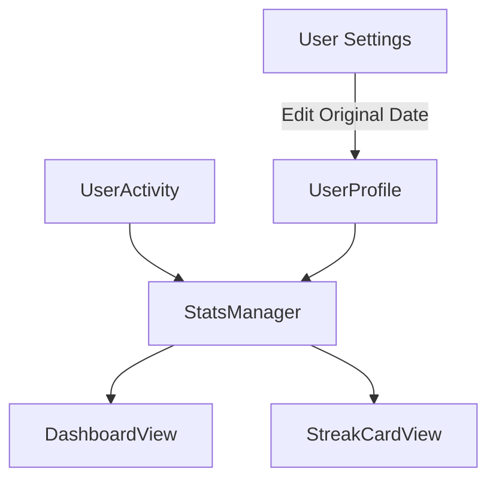

# Implementation Plan: Streak tracking & Learning Stats

Implement a streak system and learning statistics to track progress, consistency, and goal attainment.

## User Description
This change introduces an enhanced "Learning Stats" section on the Dashboard. It will show:
- **Total Hours**: Total time spent learning (App + External).
- **Total Learning Days**: Days since you first started learning (calculated from a customizable "Original Start Date").
- **Activity Streak**: Current consecutive days with any learning activity.
- **Goal Streak**: Current consecutive days meeting your daily minute goal.
- **Best Streaks**: Your historical longest activity and goal streaks.

## User Review Required
> [!IMPORTANT]
> **New Profile Fields**: We will add `longestActivityStreak`, `longestGoalStreak`, and `originalStartDate` to the `UserProfile` model. This will require a migration or self-healing initialization in the app.

## Proposed Changes

### [Component] Stats & Logic
#### [NEW] [StatsManager.swift](file:///Users/alanglass/_dev_local/Learn%20Comp%20Input/LearnCI/LearnCI/Managers/StatsManager.swift)
- Calculate total hours (synced + pending).
- Calculate "Total Learning Days" using `originalStartDate` (fallback to first activity date).
- Track and persist `longestActivityStreak` and `longestGoalStreak` in `UserProfile`.
- logic to aggregate `UserActivity` by date to determine daily goal attainment.

### [Component] UI / Dashboard
#### [MODIFY] [DashboardView.swift](file:///Users/alanglass/_dev_local/Learn%20Comp%20Input/LearnCI/LearnCI/Views/DashboardView.swift)
- Add a new `learningStatsSection` to the dashboard layout.
- Use a visually appealing card to show the key metrics (Hours, Days, Activity Streak, Goal Streak).
- Integrate with `StatsManager` to fetch live data.

#### [NEW] [StreakCardView.swift](file:///Users/alanglass/_dev_local/Learn%20Comp%20Input/LearnCI/LearnCI/Views/Components/StreakCardView.swift)
- A reusable component to display streak counts with icons (e.g., flame for activity, trophy for goal, clock for hours).

### [Component] Models
#### [MODIFY] [UserProfile.swift](file:///Users/alanglass/_dev_local/Learn%20Comp%20Input/LearnCI/LearnCI/Models/UserProfile.swift)
- [NEW] `var originalStartDate: Date?`
- [NEW] `var longestActivityStreak: Int = 0`
- [NEW] `var longestGoalStreak: Int = 0`

### [Component] Settings
#### [MODIFY] [UserProfileView.swift](file:///Users/alanglass/_dev_local/Learn%20Comp%20Input/LearnCI/LearnCI/Views/UserProfileView.swift) (or similar)
- Add a DatePicker to allow the user to set/edit their `originalStartDate`.

## Verification Plan

### Manual Verification
1.  **Total Hours**: Log 10 mins. Verify Total Hours increases.
2.  **Learning Days**: Set "Original Start Date" to 10 days ago. Verify "Days Learning" shows "11 days" (inclusive).
3.  **Streak Persistence**: Log enough activities to set a "Best Streak". Close and reopen app. Verify best streak is preserved.
4.  **Goal Tracking**: Set a goal of 10 minutes. Log 15 mins for today and yesterday. Verify goal streak shows "2 days".
5.  **Visual Check**: Ensure the dashboard cards look premium and are responsive across device sizes.
