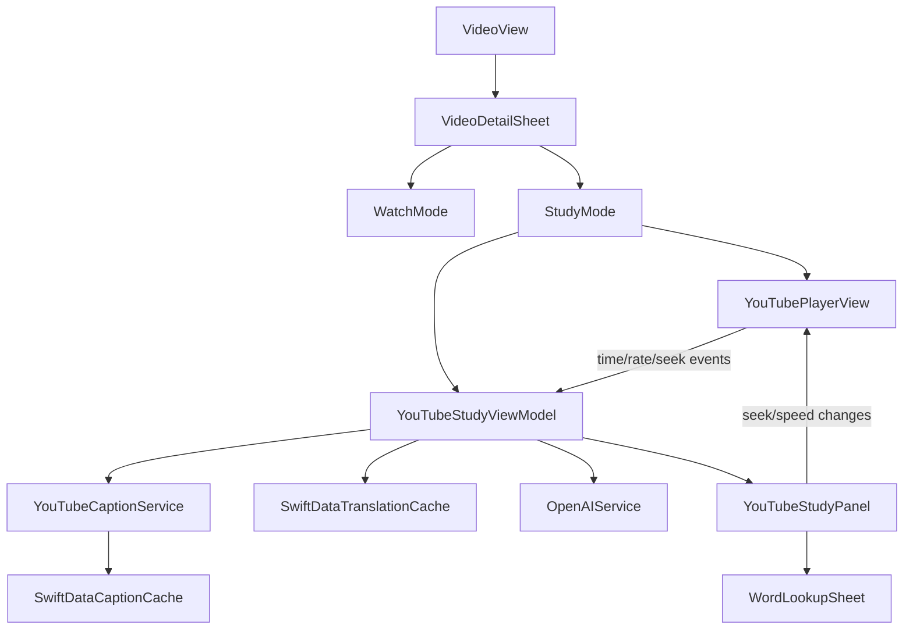

# Implementation Plan - YouTube Study Mode

## Goal Description

Add a Language Reactor-style study experience to the existing iOS YouTube flow using YouTube caption tracks, synced dual-language subtitles, playback-speed control, and cached AI-assisted word lookup.

## User Description

Users should keep the current lightweight viewing experience by default, then switch into a dedicated study experience when they want deeper language support.

- `Watch` mode remains the default inside the existing video sheet.
- `Study` mode lives in the same sheet, not a separate navigation flow.
- Study mode adds synced captions, native-language translation, speed control, tap-to-seek transcript interaction, and cached word lookup.

## Scope

Build the first version inside the existing iOS YouTube flow, not as a separate feature area.

- Use YouTube caption tracks when available, including manual and auto-generated captions.
- Show target-language captions plus native-language translation in study mode.
- Support playback-rate control from the in-app player.
- Reuse the existing AI word-lookup path, but cache per-video transcript translations and word lookups so repeated study is fast and cheaper.
- Separate general viewing from study behavior in UI state and code structure, not in app navigation.

## Current Reuse Points

Use the current YouTube browsing and player entry points instead of changing navigation:

- [LearnCI/Views/VideoView.swift](file:///Users/alanglass/_dev/LearnCompInput/LearnCI/LearnCI/Views/VideoView.swift)
- [LearnCI/Views/Components/VideoDetailSheet.swift](file:///Users/alanglass/_dev/LearnCompInput/LearnCI/LearnCI/Views/Components/VideoDetailSheet.swift)
- [LearnCI/Views/Components/YouTubePlayerView.swift](file:///Users/alanglass/_dev/LearnCompInput/LearnCI/LearnCI/Views/Components/YouTubePlayerView.swift)

Reuse the app's existing study-text patterns instead of inventing new lookup behavior:

- [LearnCI/Views/StoryMaker/StorySessionView.swift](file:///Users/alanglass/_dev/LearnCompInput/LearnCI/LearnCI/Views/StoryMaker/StorySessionView.swift)
- [LearnCI/Views/Components/TimedTextView.swift](file:///Users/alanglass/_dev/LearnCompInput/LearnCI/LearnCI/Views/Components/TimedTextView.swift)
- [LearnCI/Managers/OpenAIService.swift](file:///Users/alanglass/_dev/LearnCompInput/LearnCI/LearnCI/Managers/OpenAIService.swift)

Two existing constraints shape the implementation:

```swift
// LearnCI/Views/Components/YouTubePlayerView.swift
// Current bridge only reports play/pause/end state.
window.webkit.messageHandlers.playbackHandler.postMessage(event.data);
```

```swift
// LearnCI/Views/Components/VideoDetailSheet.swift
// Current sheet is just player + metadata + watch logging.
YouTubePlayerView(videoID: video.id, videoURL: video.videoStreamURL, watchDuration: $watchDuration)
```

## Proposed Architecture



## Implementation Plan

### 1. Add a study-mode data layer

Create a dedicated YouTube study domain instead of overloading `YouTubeVideo`.

- Add new model types for caption tracks and cues, such as `YouTubeCaptionTrack`, `YouTubeCaptionCue`, and a lightweight study-session/view-model state.
- Persist caption and translation caches separately, keyed by `videoID` and language pair, so `YouTubeVideo` stays a feed/discovery model.
- Store durable caches in SwiftData rather than `UserDefaults`, because caption payloads and translated cue sets will be much larger than the current feed cache.
- Update [LearnCI/LearnCIApp.swift](file:///Users/alanglass/_dev/LearnCompInput/LearnCI/LearnCI/LearnCIApp.swift) if new SwiftData models are added to the schema.

### 2. Add caption-track discovery and normalization

Introduce a dedicated caption service instead of further expanding [LearnCI/Managers/YouTubeManager.swift](file:///Users/alanglass/_dev/LearnCompInput/LearnCI/LearnCI/Managers/YouTubeManager.swift), which already handles auth, discovery, subscriptions, and caching.

- Add a new service such as [LearnCI/Managers/YouTubeCaptionService.swift](file:///Users/alanglass/_dev/LearnCompInput/LearnCI/LearnCI/Managers/YouTubeCaptionService.swift).
- Discover available target-language caption tracks for a selected video, preferring manual captions and falling back to auto-generated tracks.
- Fetch cue-level caption data, normalize timestamps/text, and produce a clean transcript model suitable for syncing and tap-to-seek.
- Lazily translate cues into the learner's native language and cache the translated result per video.
- Define clear fallback states: no captions, caption fetch failed, translation still processing, or captions only without translation.

### 3. Upgrade the embedded player bridge for study controls

Extend [LearnCI/Views/Components/YouTubePlayerView.swift](file:///Users/alanglass/_dev/LearnCompInput/LearnCI/LearnCI/Views/Components/YouTubePlayerView.swift) from a passive embed into a study-capable player bridge.

- Expose current playback time, duration, and playback rate from the iframe.
- Add commands for `seekTo(...)` and `setPlaybackRate(...)` so the study panel can jump to tapped lines and control speed.
- Keep existing watch-time logging, but derive it from player time/state rather than a simple local timer where possible.
- Ensure the bridge works for both standard YouTube embeds and any direct-video fallback already supported by `videoURL`.

### 4. Turn the existing video sheet into a two-mode surface

Evolve [LearnCI/Views/Components/VideoDetailSheet.swift](file:///Users/alanglass/_dev/LearnCompInput/LearnCI/LearnCI/Views/Components/VideoDetailSheet.swift) into a two-mode surface: `Watch` mode and `Study` mode.

- Add a mode toggle or segmented control near the player.
- Keep `Watch` mode close to the current experience so unsupported videos still work cleanly.
- In `Study` mode, show:
  - playback speed control,
  - current caption line in the target language,
  - native-language translation under it or in a stacked dual-subtitle layout,
  - a scrollable transcript that auto-highlights the active cue and supports tap-to-seek.
- Extract the transcript UI into a focused component such as `YouTubeStudyPanel` so the sheet stays maintainable.
- Reuse interaction patterns from [LearnCI/Views/StoryMaker/StorySessionView.swift](file:///Users/alanglass/_dev/LearnCompInput/LearnCI/LearnCI/Views/StoryMaker/StorySessionView.swift) and [LearnCI/Views/Components/TimedTextView.swift](file:///Users/alanglass/_dev/LearnCompInput/LearnCI/LearnCI/Views/Components/TimedTextView.swift) rather than duplicating word-tap logic.

### 5. Reuse and cache word lookup

Reuse the existing AI lookup flow from [LearnCI/Managers/OpenAIService.swift](file:///Users/alanglass/_dev/LearnCompInput/LearnCI/LearnCI/Managers/OpenAIService.swift) and [LearnCI/Views/StoryMaker/StorySessionView.swift](file:///Users/alanglass/_dev/LearnCompInput/LearnCI/LearnCI/Views/StoryMaker/StorySessionView.swift).

- Add tappable words in the active caption or transcript.
- On tap, show the same style of lookup sheet already used in story study: concise translation, part of speech, and optional context sentence.
- Cache results by `videoID + sourceLanguage + word + nearbyCueText` so repeat lookups are instant.
- Keep the lookup UI lightweight for the first version; richer dictionary senses or lemma analysis can be phase 2.

### 6. Add focused validation and rollout guardrails

Keep the first version tight and test the fragile parts.

- Add unit tests for caption normalization and parsing plus cache-key behavior.
- Add view-model tests for caption-track fallback order and study-state transitions.
- Manually verify three real-world cases: manual captions, auto captions, and no-caption video.
- Gate the study controls behind caption availability so the current watch experience remains unchanged for unsupported videos.

## Recommended File Touches

Likely main edits:

- [LearnCI/Views/Components/VideoDetailSheet.swift](file:///Users/alanglass/_dev/LearnCompInput/LearnCI/LearnCI/Views/Components/VideoDetailSheet.swift)
- [LearnCI/Views/Components/YouTubePlayerView.swift](file:///Users/alanglass/_dev/LearnCompInput/LearnCI/LearnCI/Views/Components/YouTubePlayerView.swift)
- [LearnCI/LearnCIApp.swift](file:///Users/alanglass/_dev/LearnCompInput/LearnCI/LearnCI/LearnCIApp.swift)
- [LearnCI/Managers/YouTubeManager.swift](file:///Users/alanglass/_dev/LearnCompInput/LearnCI/LearnCI/Managers/YouTubeManager.swift) for handoff and integration only

Likely new files:

- [LearnCI/Managers/YouTubeCaptionService.swift](file:///Users/alanglass/_dev/LearnCompInput/LearnCI/LearnCI/Managers/YouTubeCaptionService.swift)
- [LearnCI/ViewModels/YouTubeStudyViewModel.swift](file:///Users/alanglass/_dev/LearnCompInput/LearnCI/LearnCI/ViewModels/YouTubeStudyViewModel.swift)
- [LearnCI/Models/YouTubeCaptionTrack.swift](file:///Users/alanglass/_dev/LearnCompInput/LearnCI/LearnCI/Models/YouTubeCaptionTrack.swift)
- [LearnCI/Models/YouTubeCaptionCue.swift](file:///Users/alanglass/_dev/LearnCompInput/LearnCI/LearnCI/Models/YouTubeCaptionCue.swift)
- [LearnCI/Views/Components/YouTubeStudyPanel.swift](file:///Users/alanglass/_dev/LearnCompInput/LearnCI/LearnCI/Views/Components/YouTubeStudyPanel.swift)
- One or more SwiftData cache models if persistent transcript and lookup caching is added

## Phasing Recommendation

Ship this in two internal milestones.

- Milestone 1: caption retrieval, synced transcript, tap-to-seek, playback speed, and cached word lookup.
- Milestone 2: dual subtitle layout polish, sentence-level translation prefetching, saved vocabulary from transcript taps, and stronger offline and cache behavior.

This keeps the first release aligned with the current architecture while delivering the core Language Reactor behaviors requested.

## Phased Implementation PR Strategy

### PR 1: Study Foundations

Keep this PR mostly infrastructural and low-risk.

- Add study-domain models for caption tracks, cues, and cache entities.
- Register any new SwiftData models in `LearnCIApp`.
- Add `YouTubeStudyViewModel` skeleton and feature-state types.
- Leave the current `VideoDetailSheet` behavior unchanged except for wiring hooks behind the scenes.

### PR 2: Caption Pipeline

Make captions available before changing the full UI.

- Add `YouTubeCaptionService` for track discovery, fallback from manual to auto captions, and cue normalization.
- Add cache read and write behavior for raw or normalized caption payloads.
- Add parser and fallback tests.
- Surface non-invasive loading and error states in the view model.

### PR 3: Player Bridge and Mode Split

Introduce the user-visible structure with minimal transcript complexity.

- Extend `YouTubePlayerView` to expose current time, seek, and playback-rate control.
- Add the `Watch | Study` mode split inside `VideoDetailSheet`.
- Keep `Watch` mode visually close to the current layout.
- Gate `Study` mode behind caption availability and safe fallback states.

### PR 4: Study Transcript and Lookup

Deliver the main study interactions.

- Add `YouTubeStudyPanel` with active-cue highlighting and tap-to-seek transcript rows.
- Add target plus native subtitle presentation in study mode.
- Reuse the existing word lookup sheet and AI lookup flow.
- Add per-video cached cue translation and per-word cached lookup behavior.

### PR 5: Polish, Persistence, and Verification

Use a final pass for quality and follow-on learning features that should not block the core rollout.

- Improve transcript scrolling, highlight polish, and loading behavior.
- Add optional saved-vocabulary hooks if the implementation is straightforward.
- Add focused manual QA coverage across manual-caption, auto-caption, and no-caption videos.
- Tighten tests around state transitions, cache invalidation, and unsupported-video fallback behavior.
