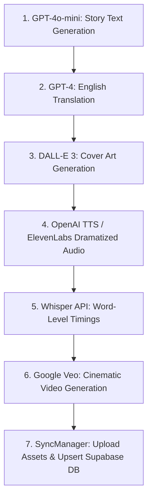

# AI Content Generation Pipeline Standard

**Scope:** Python scripts located in `scripts/` for generating story text, dramatized audio, cover art, word-level timings, and video.

---

## 1. Story Generation Pipeline (`StoryManager` & Python scripts)

Story generation follows an explicit multi-stage processing pipeline:



---

## 2. Python Environment & Script Usage

Python scripts reside in `scripts/` and run independently of the iOS app:

```bash
cd scripts
python3 -m venv venv && source venv/bin/activate
pip install -r requirements.txt

python3 generate_audio.py          # OpenAI TTS / ElevenLabs multi-voice TTS
python3 generate_images.py         # DALL-E 3 cover art
python3 generate_video.py          # Google Veo cinematic videos
python3 generate_ambient_sounds.py # Ambient background loops
python3 check_media.py             # Asset integrity audit
```

### Environment Secrets Requirement
Requires `scripts/.env` file with key assignments:
```text
SUPABASE_URL=https://vuygqrbludhuywupcbma.supabase.co
SUPABASE_KEY=your-supabase-key
OPENAI_API_KEY=your-openai-key
ELEVENLABS_API_KEY=your-elevenlabs-key
GEMINI_API_KEY=your-gemini-key
```

---

## 3. Dramatized Audio Conventions

- Speaker tags (e.g., `[Narrator]`, `[Character A]`) in generated story text guide multi-voice assignment during ElevenLabs rendering.
- Word-level Whisper timestamps are saved alongside audio files to drive real-time text highlighting in the reading view.
