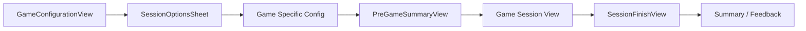

# Game Session Lifecycle & Specifications Standard

**Scope:** The 7-stage game session architecture, vocabulary game implementations, settings management, and deck queueing.

---

## 1. The 7-Stage Game Lifecycle

All games in LearnCI follow a unified 7-stage lifecycle flow:

1. **`GameConfigurationView`**: Select target deck or tag filter.
2. **`SessionOptionsSheet`**: Configure universal parameters (duration, card goal, order, TTS rate).
3. **`Game-Specific Config`**: Game-customized settings (e.g., `linkerTargetMode` for Column Connect).
4. **`PreGameSummaryView`**: Final confirmation screen before countdown.
5. **`Game Session View`**: Interactive gameplay view driven by `GameSessionViewModel`.
6. **`SessionFinishView`**: Summary statistics, score, accuracy, and XP earned.
7. **Feedback / Sync**: Save user performance activity via `UserActivity` model.

---

## 2. Game Types & Mechanics

| Game Mode | Mechanics | ViewModel | Card Queue |
|---|---|---|---|
| **Flashcards** | Flip cards, SRS grading (Relearn/Learned) | Stateless View | `SmartSessionManager` |
| **Memory Match** | 4x4 grid pair matching (mult. of 8 cards) | `MemoryGameView` state | Internal shuffle |
| **Story Mode** | Page-by-page linear story reading | Reuses Flashcard view | Sequential order |
| **Multiple Choice** | 4-option vocabulary quizzes | Stateless View | `SmartSessionManager` |
| **Audio Cloze** | Listening fill-in-the-blank challenge | Stateless View | `SmartSessionManager` |
| **Column Connect (Linker)** | 3-round matching (Word, Image, Audio) | `LinkerGameViewModel` | Per-round queue |
| **Word Crush** | Tile/grid vocabulary clearing | `WordCrushViewModel` | Custom grid logic |

---

## 3. Session Settings Guidelines

- **Universal Settings**: `sessionDuration`, `sessionCardGoal`, `order` (Sequential, Random, Smart Queue), `useTTSFallback`, `ttsRate`.
- **Virtual Decks**: `DataManager.createVirtualDeck()` generates tag-filtered transient card lists without mutating local database records.
- **Card Constraints**: Memory Match card goal must be a multiple of 8.
